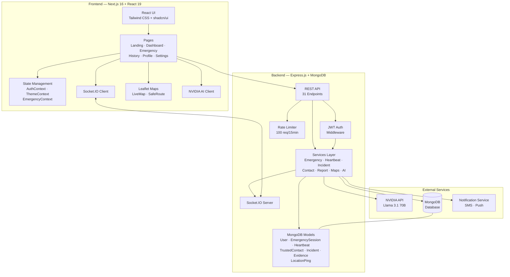
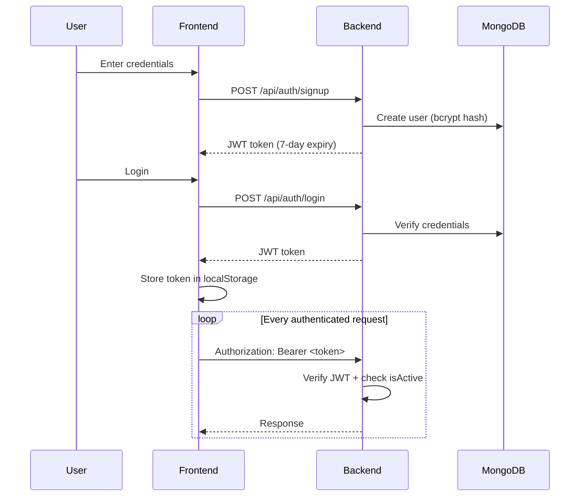
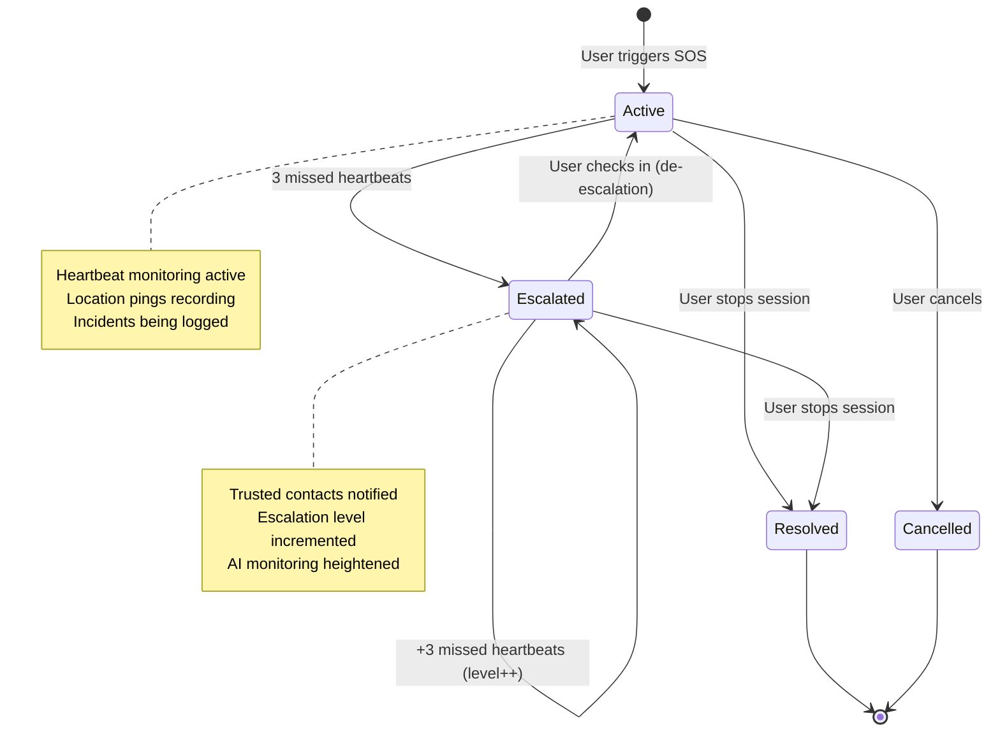
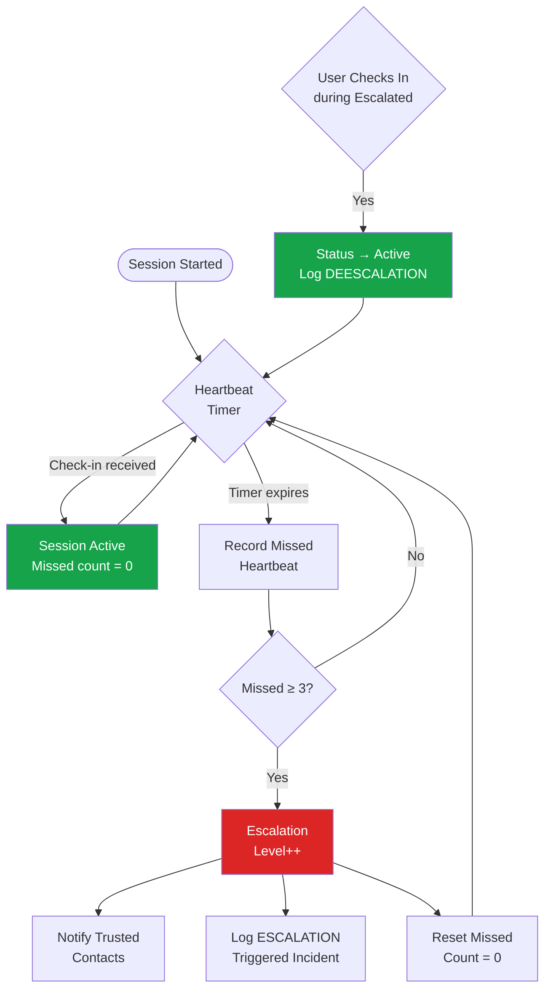
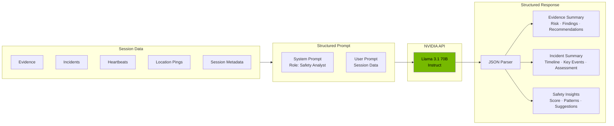
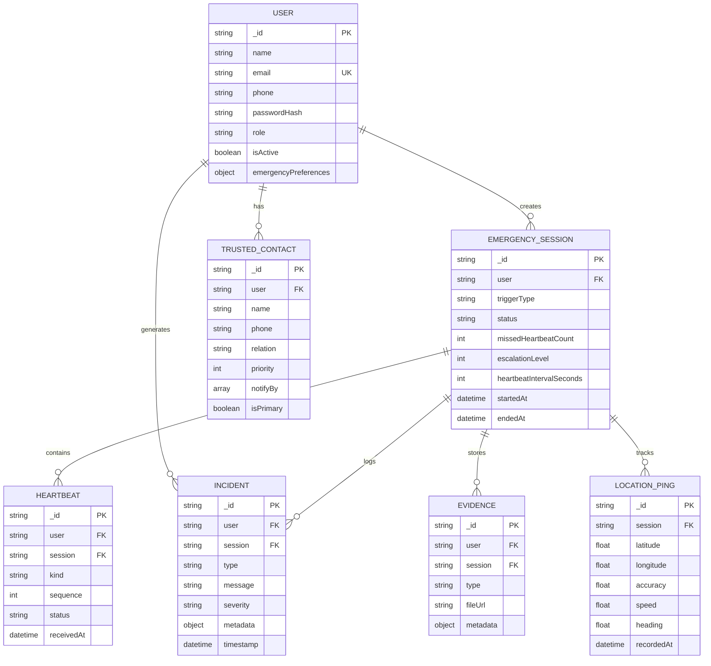
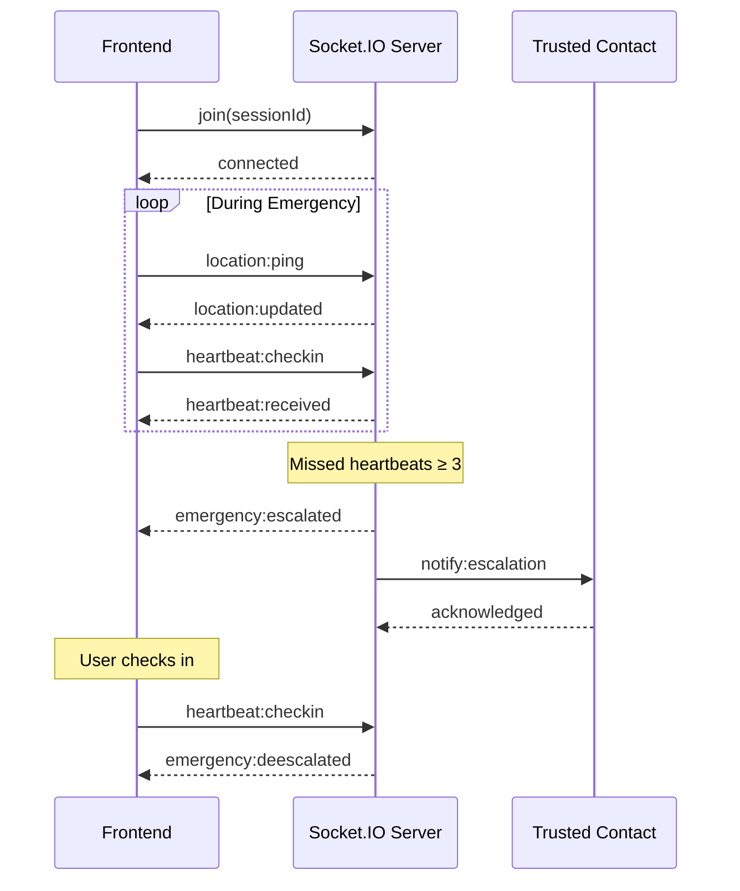
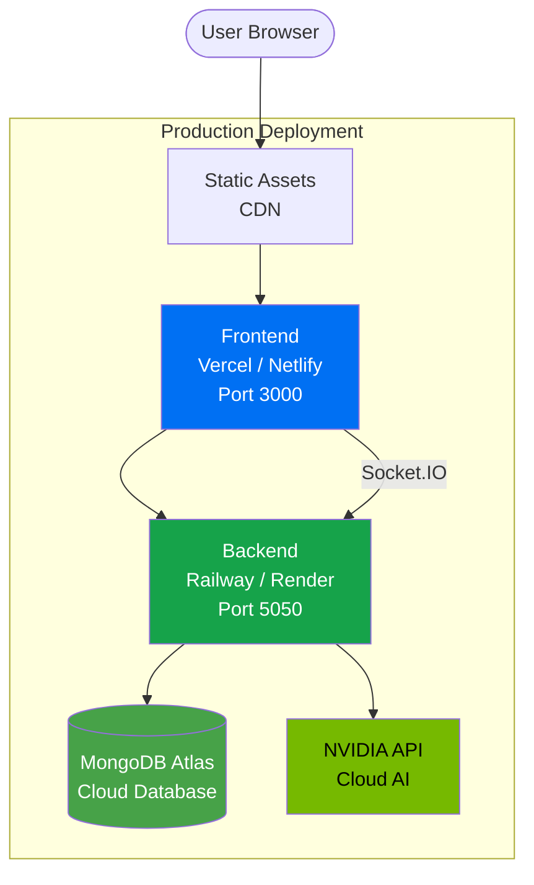

# Architecture

## System Overview

## Authentication Flow

## Emergency Session Lifecycle

## Heartbeat & Escalation Flow

## AI Analysis Pipeline

## Data Model

## Real-Time Communication

## API Architecture

```mermaid
graph LR
    subgraph Middleware["Middleware Pipeline"]
        M1[Helmet<br/>Security Headers]
        M2[CORS<br/>Cross-Origin]
        M3[JSON Parser<br/>10MB Limit]
        M4[Logger<br/>Request Log]
        M5[Rate Limiter<br/>100/15min]
    end

    subgraph Routes["API Routes (31 endpoints)"]
        R1["/api/auth/*<br/>3 routes"]
        R2["/api/users/*<br/>3 routes"]
        R3["/api/emergency/*<br/>5 routes"]
        R4["/api/heartbeat/*<br/>3 routes"]
        R5["/api/incidents/*<br/>3 routes"]
        R6["/api/contacts/*<br/>4 routes"]
        R7["/api/reports/*<br/>3 routes"]
        R8["/api/maps/*<br/>3 routes"]
        R9["/api/ai/*<br/>3 routes"]
    end

    subgraph Error["Error Handler"]
        EH[Centralized Error Handler<br/>No Stack Trace Leakage]
    end

    M1 --> M2 --> M3 --> M4 --> M5 --> Routes
    Routes --> EH
```

## Deployment Architecture

